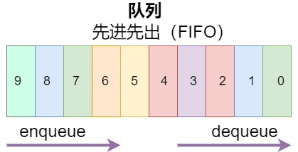

## 队列

队列是遵循`先进先出（FIFO）`原则的一组有序的项。


**队列的主要方法**

1. enqueue(element)：向队列尾部添加一个或多个新的项
2. dequeue：移除队列的第一项并返回被移除的元素
3. peek：返回队列的第一个元素
4. isEmpty：查看队列是否为空
5. size：查看队列的元素个数
6. clear：清空队列

### 基于 js 对象的队列

```js
class Queue {
  constructor() {
    this.count = 0; //控制队列的大小
    this.lowestCount = 0; //用来追踪第一个元素
    this.items = {};
  }
  //enqueue向队列末尾添加一个元素
  enqueue(element) {
    this.items[this.count] = element;
    this.count++;
  }
  //isEmpty查看队列是否为空
  isEmpty() {
    return this.count - this.lowestCount === 0;
  }
  //dequeue移除队列的第一个元素并返回被移除的元素
  dequeue() {
    if (this.isEmpty()) return "";
    let reuslt = this.items[this.lowestCount];
    delete this.items[this.lowestCount];
    this.lowestCount++;
    return reuslt;
  }
  //peek查看队列头元素
  peek() {
    if (this.isEmpty()) return "";
    return this.items[this.lowestCount];
  }
  //size查看队列的元素个数
  size() {
    return this.count - this.lowestCount;
  }
  //clear清空队列
  clear() {
    this.count = 0;
    this.lowestCount = 0;
    this.items = {};
  }
  toString() {
    if (this.isEmpty()) return "";
    let objString = this.items[this.lowestCount];
    for (let i = this.lowestCount + 1; i < this.count; i++) {
      objString = `${objString},${this.items[i]}`;
    }
    return objString;
  }
}
```

## 双端队列

`双端队列(double-ended queue)`是一种可以从前端和后端添加和移除元素的特殊队列。

**双端队列的主要方法**

1. addFront(element)：向前端添加新的元素
2. addBack(element)：向后端添加新的元素
3. removeFront：从前端移除第一个元素
4. removeBack：从后端移除第一个元素
5. peekFront：查看前端第一个元素
6. peekBack：查看后端第一个元素

### 基于 js 对象的双端队列

```js
class Deque {
  constructor() {
    this.count = 0;
    this.lowestCount = 0;
    this.items = {};
  }
  //向前端添加新的元素
  addFront(element) {
    if (this.isEmpty()) {
      this.addBack(element);
      return;
    }
    if (this.lowestCount > 0) {
      this.lowestCount--;
      this.items[this.lowestCount] = element;
      return;
    }

    for (let i = 1; i <= this.count; i++) {
      this.items[i] = this.items[i - 1];
    }
    this.count++;
    this.items[0] = element;
  }
  //向后端添加新的元素
  addBack(element) {
    this.items[this.count] = element;
    this.count++;
  }
  // 从前端移除第一个元素
  removeFront() {
    if (this.isEmpty()) return "";
    let result = this.items[this.lowestCount];
    delete this.items[this.lowestCount];
    this.lowestCount++;
    return result;
  }
  // 从后端移除第一个元素
  removeBack() {
    if (this.isEmpty()) return "";
    let result = this.items[this.count - 1];
    delete this.items[this.count - 1];
    this.count--;
    return result;
  }
  //查看前端第一个元素
  peekFront() {
    return this.items[this.lowestCount];
  }
  //查看后端第一个元素
  peekBack() {
    return this.items[this.count - 1];
  }
  //检查队列是否为空
  isEmpty() {
    return this.count - this.lowestCount === 0;
  }
  //查看队列内的元素个数
  size() {
    return this.count - this.lowestCount;
  }
  toString() {
    if (this.isEmpty()) return "";
    let objString = this.items[this.lowestCount];
    for (let i = this.lowestCount + 1; i < this.count; i++) {
      objString = `${objString},${this.items[i]}`;
    }
    return objString;
  }
}
```

### 使用队列解决问题

**击鼓传花游戏**

`使用循环队列实现击鼓传花游戏`

> 某一时刻传花停止，这个时候花在谁手里，谁就退出圆圈、结束游戏。重复这个过程，直到只剩一个孩子（胜者）

```js
//使用循环队列实现击鼓传花游戏
import Queue from "./queue.js";
function hotpotato(elementList, num) {
  let queue = new Queue();
  let eliminateList = [];

  for (const element of elementList) {
    queue.enqueue(element);
  }

  while (queue.size() > 1) {
    for (let i = 0; i < num; i++) {
      queue.enqueue(queue.dequeue());
    }
    eliminateList.push(queue.dequeue());
  }

  return {
    num: num,
    eliminateList: eliminateList,
    winner: queue.dequeue(),
  };
}
function randomNum() {
  return Math.floor(Math.random() * 100 + 1);
}
let elementList = ["jack", "nick", "mark", "bob", "mary", "sam", "jecik"];
console.log(hotpotato(elementList, randomNum()));
console.log(hotpotato(elementList, randomNum()));
console.log(hotpotato(elementList, randomNum()));
```

**回文检查器**

`使用双端队列实现一个回文检查器`

> 回文是正反都能读通的单词、词组、数或一系列字符的序列，例如 madam

```js
import Deque from "./double-ended-queue.js";
function palindromeChecker(str) {
  if (str === "" || str === undefined || str === null) return false;
  const deque = new Deque();
  const lowerString = str.toLocaleLowerCase().split(" ").join("");
  let firstChar, lastChar;
  let isEqual = true;

  for (let i = 0; i < lowerString.length; i++) {
    deque.addBack(lowerString.charAt(i));
  }

  while (isEqual && deque.size() > 1) {
    firstChar = deque.removeFront();
    lastChar = deque.removeBack();
    if (firstChar !== lastChar) {
      isEqual = false;
    }
  }
  return isEqual;
}
console.log("madam ", palindromeChecker("madam"));
console.log("hello ", palindromeChecker("hello"));
```
