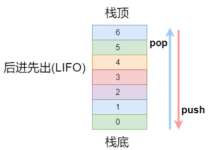

## 栈 LIFO

栈是一种遵循`后进先出（LIFO）`原则的有序集合。


**一个栈的基本方法**

1. push(element)：添加一个或几个元素到栈顶
2. pop()：移除栈顶的元素，同时返回被移除的元素。
3. peek()：查看栈顶的元素
4. isEmpty()：检查栈是否为空。
5. clear()：清空栈元素。
6. size()：返回栈里的元素个数

### 基于数组的栈

```js
class Stack {
  constructor() {
    this.items = [];
  }
  //添加一个或几个元素到栈顶
  push(element) {
    this.items.push(element);
  }
  //移除栈顶的元素，同时返回被移除的元素。
  pop() {
    return this.items.pop();
  }
  //查看栈顶的元素
  peek() {
    return this.items[this.items.length - 1];
  }
  //如果栈里没有元素就返回true，否则返回false。
  isEmpty() {
    return !Boolean(this.items.length);
  }
  //移除栈里的所有元素。
  clear() {
    this.items = [];
  }
  //返回栈里的元素个数
  size() {
    return this.items.length;
  }
  toString() {
    return this.items.toString();
  }
}
```

### 基于 js 对象的栈

```js
class Stack {
  constructor() {
    this.count = 0;
    this.items = {};
  }
  push(element) {
    this.items[this.count] = element;
    this.count++;
  }
  size() {
    return this.count;
  }
  isEmpty() {
    return this.count === 0;
  }
  pop() {
    if (this.isEmpty()) return undefined;
    this.count--;
    let result = this.items[this.count];
    delete this.items[this.count];
    return result;
  }
  peek() {
    if (this.isEmpty()) return undefined;
    return this.items[this.count - 1];
  }
  clear() {
    this.items = {};
    this.count = 0;
  }
  toString() {
    return this.items.toString();
  }
}
```

**使用 Stack 的实例** 

`进制转换`

```js
function baseConverter(decNumber, base) {
  let stack = new Stack();
  let rem = 0;
  let number = decNumber;
  let digits = "0123456789ABCDEFGHIJKLMNOPQRSTUVWXYZ";
  let baseString = "";

  if (!(base >= 2 && base <= 36)) return "";

  while (number > 0) {
    rem = Math.floor(number % base);
    stack.push(rem);
    number = Math.floor(number / base);
  }

  while (!stack.isEmpty()) {
    baseString += digits[stack.pop()];
  }

  return baseString;
}
console.log(baseConverter(35, 2));
```
