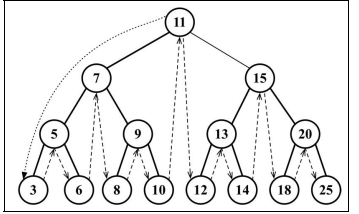
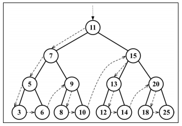
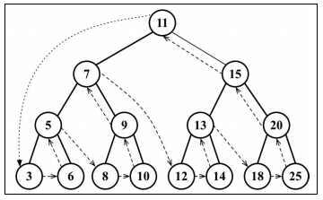
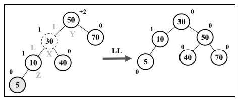
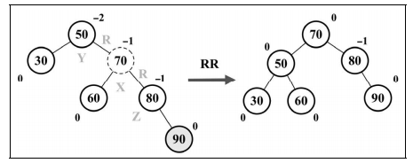
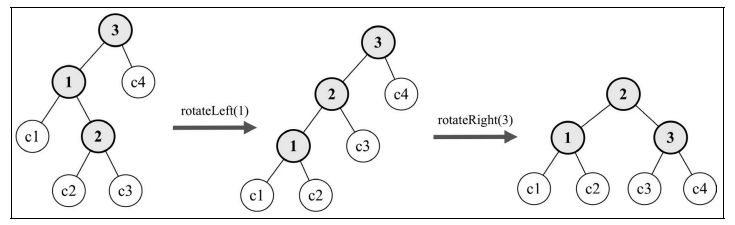
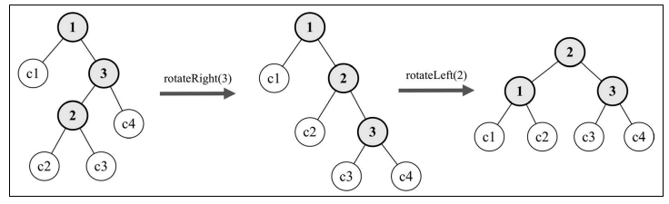
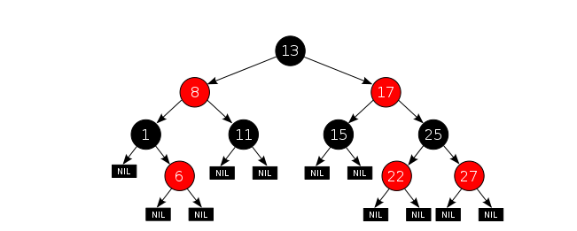

# **树 Tree**

一个树结构包含一系列存在父子关系的节点，每个节点都有一个父节点（除了顶部第一个节点没有父节点）以及零个或多个子节点。

**术语：**

1. `根节点`：位于树顶部的节点，它没有父节点。
2. `内部节点`：只有一个子节点的节点。
3. `外部节点`：没有子节点的节点。
4. `子树`：子树有节点和它的后代构成。

## **二叉树**

`二叉树中的节点最多只能有两个子节点：一个是左侧节点，另一个是右侧节点。`

**二叉树需要实现的方法：**

1. insert(key)：向树中插入一个新的键。
2. search(key)：在树中查找一个键，如果节点存在则返回 true，否则返回 false。
3. inOrderTraverse()：通过中序遍历方式遍历所有节点。
4. preOrderTraverse()：通过先序遍历方式遍历所有节点。
5. postOrderTraverse()：通过后序遍历方式遍历所有节点。
6. min()：返回树中最小的值/键。
7. max()：返回树中最大的值/键。
8. search(key)：在树中搜索特定值，有则返回 true，否则返回 false。
9. remove(key)：从树中移除某个键。

### **二叉搜索树（BST）**

二叉搜索树（BST） `是二叉树的一种,但是只允许你在左侧节点存储比父节点小的值，右侧节点存储比父节点大的值。`

**BST 遍历：**

- `中序遍历`：以一种上行顺序访问 BST 的所有节点，也就是从最小到最大的顺序访问所有节点(排序操作)。

  

- `先序遍历`：以优先于后代节点的顺序访问每个节点，先序遍历的一种应用是打印一个结构化的文档。

  

- `后序遍历`：先访问节点的后代节点，再访问节点本身。后序遍历的一种应用是计算一个目录及其子目录中所有文件占空间的大小。

  

**搜索树中的值：**

- 搜索最小值
- 搜索最大值
- 搜索特定值

#### **二叉搜索树 BST 代码实现**

```js
import { Compare, defaultCompare } from "./utils.js";
class Node {
  constructor(key) {
    this.key = key; //节点值
    this.left = null; //左侧子节点引用
    this.right = null; //右侧子节点引用
  }
}

class BinarySearchTree {
  constructor(compareFn = defaultCompare) {
    this.compareFn = compareFn;
    this.root = null; //Node类型的根节点
  }
  // 向树中插入一个新的键
  insert(key) {
    if (this.root === null) {
      this.root = new Node(key);
      return;
    }
    this.insertNode(this.root, key);
  }
  insertNode(node, key) {
    if (this.compareFn(key, node.key) === Compare.LESS_THAN) {
      //左侧插入
      if (node.left === null) {
        node.left = new Node(key);
        return;
      }
      this.insertNode(node.left, key);
    } else {
      //右侧插入
      if (node.right === null) {
        node.right = new Node(key);
        return;
      }
      this.insertNode(node.right, key);
    }
  }
  //通过中序遍历访问所有节点
  inOrderTraverse(callback) {
    this.inOrderTraverseNode(this.root, callback);
  }
  inOrderTraverseNode(node, callback) {
    if (node === null) return;
    this.inOrderTraverseNode(node.left, callback);
    callback(node.key);
    this.inOrderTraverseNode(node.right, callback);
  }
  //先序遍历
  preOrderTraverse(callback) {
    this.preOrderTraverseNode(this.root, callback);
  }
  preOrderTraverseNode(node, callback) {
    if (node === null) return;
    callback(node.key);
    this.preOrderTraverseNode(node.left, callback);
    this.preOrderTraverseNode(node.right, callback);
  }

  //后序遍历
  postOrderTraverse(callback) {
    this.postOrderTraverseNode(this.root, callback);
  }
  postOrderTraverseNode(node, callback) {
    if (node === null) return;
    this.postOrderTraverseNode(node.left, callback);
    this.postOrderTraverseNode(node.right, callback);
    callback(node.key);
  }

  //返回树中最小的值/键
  min() {
    return this.minNode(this.root);
  }
  minNode(node) {
    if (node != null && node.left == null) return node.key;
    return this.minNode(node.left);
  }
  // 返回树中最大的值/键
  max() {
    return this.maxNode(this.root);
  }
  maxNode(node) {
    if (node != null && node.right == null) return node.key;
    return this.maxNode(node.right);
  }

  //在树中搜索特定值，有则返回true，否则返回false。
  search(key) {
    return this.searchNode(this.root, key);
  }
  searchNode(node, key) {
    if (node === null) return false;
    if (this.compareFn(key, node.key) === Compare.LESS_THAN) {
      return this.searchNode(node.left, key);
    }
    if (this.compareFn(key, node.key) === Compare.BIGGER_THAN) {
      return this.searchNode(node.right, key);
    }
    return true;
  }

  //从树中移除某个键
  remove(key) {
    this.root = this.removeNode(this.root, key);
  }
  removeNode(node, key) {
    if (node === null) return null;
    if (this.compareFn(key, node.key) === Compare.LESS_THAN) {
      node.left = this.removeNode(node.left, key);
      return node;
    }
    if (this.compareFn(key, node.key) === Compare.BIGGER_THAN) {
      node.right = this.removeNode(node.right, key);
      return node;
    }
    //第一种情况，移除没有子节点的叶节点
    if (node.left === null && node.right === null) {
      node = null;
      return node;
    }
    //第二种情况，移除只有左节点或只有右节点的节点
    if (node.left === null) {
      node = node.right;
      return node;
    }
    if (node.right === null) {
      node = node.left;
      return node;
    }

    //第三种情况，移除拥有左节点和右节点两个节点的节点
    let min = this.minNode(node.right); //找到右侧最小的节点值
    node.key = min; //将右侧最新值更新为当前节点值，相当于移除了当前节点。
    node.right = this.removeNode(node.right, min); //再移除min
    return node;
  }
}

let tree = new BinarySearchTree();
tree.insert(11);
tree.insert(7);
tree.insert(15);
tree.insert(5);
tree.insert(3);
tree.insert(9);
tree.insert(8);
tree.insert(10);
tree.insert(13);
tree.insert(12);
tree.insert(14);
tree.insert(20);
tree.insert(18);
tree.insert(25);
tree.remove(7);
console.log(tree.root);
console.log("=====中序遍历=======");
tree.inOrderTraverse((key) => {
  console.log(key);
});
console.log("=====先序遍历=======");
tree.preOrderTraverse((key) => {
  console.log(key);
});
console.log("=====后序遍历=======");
tree.postOrderTraverse((key) => {
  console.log(key);
});
console.log("最小值：", tree.min());
console.log("最大值：", tree.max());
console.log("search: 3", tree.search(3));
```

### **自平衡二叉搜索树（AVL 树）**

AVL 树是一种自平衡二叉搜索树，添加或移除节点时，AVL 树会尝试保持自平衡。任意一个节点（不论深度）的左子树和右子树高度最多相差 1。添加或移除节点时，AVL 树会尽可能尝试转换为完全树。

#### **术语：**

**1. 节点高度和平衡因子**

节点的高度是从节点到其任意子节点的边的最大值。在 AVL 树种，需要对每个节点计算左子树高度（hr）和右子树高度（hl）之间的差值，该值（hl-hr）应为 0、1 或-1，如果不是这个三个值之一，则需要平衡该 AVL 树。

**2. 平衡操作---AVL 旋转**

- 左-左（LL）：向右的单旋转 (节点的左侧子节点高度大于右侧子节点的高度)
- 右-右（RR）：向左的单旋转
- 左-右（LR）：向右的双旋转（先 LL 旋转，再 RR 旋转）
- 右-左（RL）：向左的双旋转（先 RR 旋转，再 LL 旋转）

##### **LL 向右的单旋转**

`节点的左侧子节点高度大于右侧子节点的高度，并且左侧子节点也是平衡或左侧比较重。`



```js
 //向右的单旋转
 rotationLL(node) {
        let tmp = node.left
        node.left = tmp.right
        tmp.right = node
        return tmp
    }
```

##### **RR 向左的单旋转**

`节点的右侧子节点高度大于左侧子节点高度，并且右侧子节点也是平衡或右侧比较重。`



```js
 //向左的单旋转
    rotationRR(node) {
        let tmp = node.right
        node.right = tmp.left
        tmp.left = node
        return tmp
    }
```

##### **LR 向右的双旋转**

节点的左侧子节点高度大于右侧子节点高度，且左侧子节点右侧较重。



```js
    //向右的双旋转,节点的左侧子节点高度大于右侧子节点高度，且左侧子节点的右侧较重。
    rotationLR(node){
        node.left = this.rotationRR(node.left)
        return this.rotationLL(node)
    }
```

##### **RL 向左的双旋转**

节点的右侧子节点高度大于左侧子节点高度，且右侧子节点左侧较重。



```js
    rotationRL(node){
        node.right = this.rotationLL(node.right)
        return this.rotationRR(node)
    }
```

#### 自平衡 BST 实现

```js
import { Compare, defaultCompare } from "./utils.js";
import { Node } from "./model.js";
import BinarySearchTree from "./binary-search-tree.js";

const BalanceFactor = {
  UNBALANCE_RIGHT: 1,
  SLIGHTLY_UNBALANCE_RIGHT: 2,
  BALANCE: 3,
  UNBALANCE_LEFT: 4,
  SLIGHTLY_UNBALANCE_LEFT: 5,
};

class AVLTree extends BinarySearchTree {
  constructor(compareFn = defaultCompare) {
    super(compareFn);
    this.compareFn = compareFn;
    this.root = null;
  }
  //获取节点的高度
  getNodeHeight(node) {
    if (node === null) return -1;
    return Math.max(this.getNodeHeight(node.left), this.getNodeHeight(node.right)) + 1;
  }

  // 获取节点平衡因子
  getBalanceFactor(node) {
    let heightDifference = this.getNodeHeight(node.left) - this.getNodeHeight(node.right);
    switch (heightDifference) {
      case -2:
        return BalanceFactor.UNBALANCE_RIGHT;
      case -1:
        return BalanceFactor.SLIGHTLY_UNBALANCE_RIGHT;
      case 1:
        return BalanceFactor.SLIGHTLY_UNBALANCE_LEFT;
      case 2:
        return BalanceFactor.UNBALANCE_LEFT;
      default:
        return BalanceFactor.BALANCE;
    }
  }

  //左侧比较重，向右的单旋转
  rotationLL(node) {
    let tmp = node.left;
    node.left = tmp.right;
    tmp.right = node;
    return tmp;
  }

  //右侧比较重，向左的单旋转
  rotationRR(node) {
    let tmp = node.right;
    node.right = tmp.left;
    tmp.left = node;
    return tmp;
  }

  //向右的双旋转,节点的左侧子节点高度大于右侧子节点高度，且左侧子节点的右侧较重。
  rotationLR(node) {
    node.left = this.rotationRR(node.left);
    return this.rotationLL(node);
  }

  // 向左的双旋转,节点的右侧子节点高度大于左侧子节点高度，且右侧子节点的左侧较重。
  rotationRL(node) {
    node.right = this.rotationLL(node.right);
    return this.rotationRR(node);
  }

  //插入节点
  insert(key) {
    this.root = this.insertNode(this.root, key);
  }
  insertNode(node, key) {
    if (node === null) {
      return new Node(key);
    }
    if (this.compareFn(key, node.key) === Compare.LESS_THAN) {
      node.left = this.insertNode(node.left, key);
    } else if (this.compareFn(key, node.key) === Compare.BIGGER_THAN) {
      node.right = this.insertNode(node.right, key);
    } else {
      //重复的键
      return node;
    }

    // 检查节点是否需要进行平衡操作
    let balanceFactor = this.getBalanceFactor(node); //获取节点平衡因子
    if (balanceFactor === BalanceFactor.UNBALANCE_LEFT) {
      if (this.compareFn(key, node.left.key) === Compare.LESS_THAN) {
        node = this.rotationLL(node);
      } else {
        node = this.rotationLR(node);
      }
    }
    if (balanceFactor === BalanceFactor.UNBALANCE_RIGHT) {
      if (this.compareFn(key, node.right.key) === Compare.BIGGER_THAN) {
        node = this.rotationRR(node);
      } else {
        node = this.rotationRL(node);
      }
    }
    return node;
  }

  //移除一个节点
  remove(key) {
    this.root = this.removeNode(this.root, key);
  }
  removeNode(node, key) {
    node = super.removeNode(node, key);
    if (node === null) return null;

    //    移除某个键后检查是否需要平衡操作
    let balanceFactor = this.getBalanceFactor(node);
    console.log(balanceFactor, node);
    if (balanceFactor === BalanceFactor.UNBALANCE_LEFT) {
      let factorLeft = this.getBalanceFactor(node.left);
      if (factorLeft === BalanceFactor.BALANCE || BalanceFactor.SLIGHTLY_UNBALANCE_LEFT) {
        return this.rotationLL(node);
      }
      if (factorLeft === BalanceFactor.SLIGHTLY_UNBALANCE_RIGHT) {
        return this.rotationLR(node);
      }
    }
    if (balanceFactor === BalanceFactor.UNBALANCE_RIGHT) {
      let factorRight = this.getBalanceFactor(node.right);
      if (factorRight === BalanceFactor.BALANCE || factorRight === BalanceFactor.SLIGHTLY_UNBALANCE_RIGHT) {
        return this.rotationRR(node);
      }
      if (factorRight === BalanceFactor.SLIGHTLY_UNBALANCE_LEFT) {
        return this.rotationRL(node);
      }
    }
    return node;
  }
}

let avlTree = new AVLTree();
avlTree.insert(50);
avlTree.insert(70);
avlTree.insert(80);
avlTree.insert(90);
avlTree.insert(72);
avlTree.insert(75);
avlTree.insert(73);
avlTree.insert(74);
console.log(avlTree.root);
avlTree.remove(50);
console.log(avlTree.root);
```

### **红黑树**

红黑树也是一个自平衡二叉搜索树。

**理解红黑树的性质：**

1. 节点是红色或黑色。
2. 树的根节点是黑的。
3. 所有叶子都是黑的（叶子是 NIL 节点）。
4. 每个红色节点必须有两个黑色的子节点
5. 从给定节点到它的每个叶子节点的所有路径包含相同数量的黑色节点。

**图例：**



##### **红黑树代码实现**

```js
import { Compare, defaultCompare } from "./utils.js";
import { RedBlackNode, Colors } from "./model.js";
import BinarySearchTree from "./binary-search-tree.js";

class RedBlackTree extends BinarySearchTree {
  constructor(compareFn = defaultCompare) {
    super(compareFn);
    this.compareFn = compareFn;
    this.root = null;
  }
  insert(key) {
    if (this.root === null) {
      this.root = new RedBlackNode(key);
      this.root.color = Colors.BLACK;
      return;
    }
    let newNode = this.insertNode(this.root, key);
    this.fixTreeProperties(newNode);
  }
  insertNode(node, key) {
    //第一种情况，左侧插入
    if (this.compareFn(key, node.key) === Compare.LESS_THAN) {
      if (node.left === null) {
        node.left = new RedBlackNode(key);
        node.left.parent = node;
        return node.left;
      }
      return this.insertNode(node.left, key);
    }
    //第二种情况，右侧插入
    if (this.compareFn(key, node.key) === Compare.BIGGER_THAN) {
      if (node.right === null) {
        node.right = new RedBlackNode(key);
        node.right.parent = node;
        return node.right;
      }
      return this.insertNode(node.right, key);
    }
    //第三种情况，相同的键，不用操作
    return null;
  }

  rotationRR(node) {
    if (node === null) return;
    let tmp = node.right;
    node.right = tmp.left;
    tmp.parent = node.parent;
    if (tmp.left && tmp.left.key) {
      tmp.left.parent = node;
    }
    if (!node.parent) {
      this.root = tmp;
    } else {
      if (node === node.parent.left) {
        node.parent.left = tmp;
      } else {
        node.parent.right = tmp;
      }
    }

    tmp.left = node;
    node.parent = tmp;
  }
  rotationLL(node) {
    let tmp = node.left;
    node.left = tmp.right;
    if (tmp.right && tmp.right.key) {
      tmp.right.parent = node;
    }
    tmp.parent = node.parent;
    if (!node.parent) {
      this.root = tmp;
    } else {
      if (node === node.parent.right) {
        node.parent.right = tmp;
      } else {
        node.parent.left = tmp;
      }
    }
    tmp.right = node;
    node.parent = tmp;
  }

  fixTreeProperties(node) {
    while (node && node.parent && node.isRed() && node.parent.isRed()) {
      let parent = node.parent;
      let grandParent = parent.parent;

      //第一种情况：父节点是左侧子节点
      if (grandParent && grandParent.left === parent) {
        let uncle = grandParent.right;
        //情况A:叔节点存在并且颜色是红色的。
        if (uncle && uncle.isRed() && grandParent.parent) {
          grandParent.color = Colors.RED;
          parent.color = Colors.BLACK;
          uncle.color = Colors.BLACK;
          node = grandParent;
          continue;
        }
        //父节点的右侧节点较重
        if (node === parent.right) {
          this.rotationRR(parent); //向左的单旋转
          node = parent;
          parent = node.parent;
        }
        this.rotationLL(grandParent);
        parent.color = Colors.BLACK;
        grandParent.color = Colors.RED;
        node = parent;
        continue;
      }

      //第二种情况：父节点是右子节点
      if (grandParent && grandParent.right === parent) {
        let uncle = grandParent.left;
        if (uncle && uncle.isRed() && grandParent.parent) {
          grandParent.color = Colors.RED;
          parent.color = Colors.BLACK;
          uncle.color = Colors.BLACK;
          node = grandParent;
          continue;
        }
        //父节点左侧较重
        if (parent.left === node) {
          this.rotationLL(parent);
          node = parent;
          parent = node.parent;
        }
        this.rotationRR(grandParent);
        parent.color = Colors.BLACK;
        grandParent.color = Colors.RED;
        node = parent;
      }
    }
    this.root.color = Colors.BLACK;
  }
}

let redBlackTree = new RedBlackTree();
redBlackTree.insert(1);
redBlackTree.insert(2);
redBlackTree.insert(3);
redBlackTree.insert(4);
redBlackTree.insert(5);
redBlackTree.insert(6);
redBlackTree.insert(7);
redBlackTree.insert(8);
console.log(redBlackTree.root);
```
